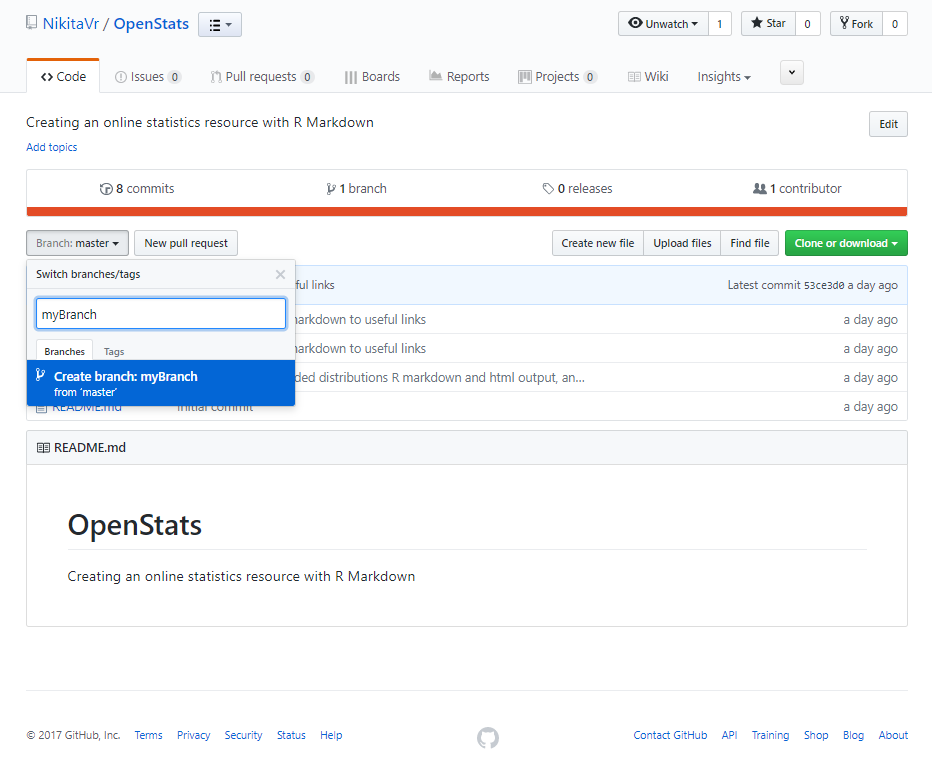
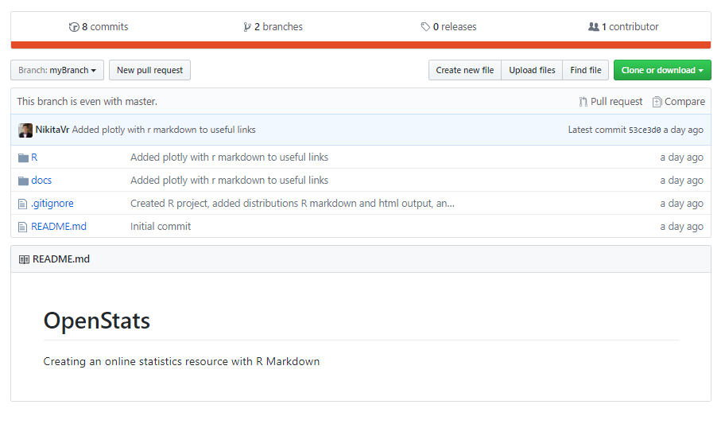
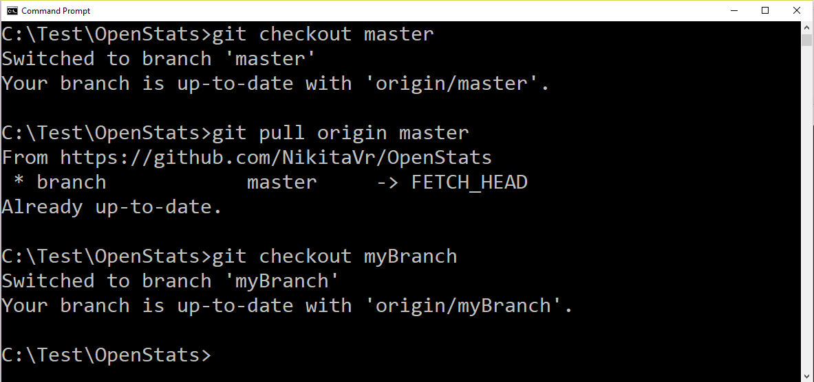

```{r setup, include=FALSE}
knitr::opts_chunk$set(echo = TRUE)
```

# Contributing

some new stuff

[Home](../index.html)

## Setup

### Get The Project

This whole site is on github at https://github.com/NikitaVr/OpenStats

Navigate to where you want to have your OpenStats Project folder to be.

For these steps you need to have git installed.

```
git clone https://github.com/NikitaVr/OpenStats
cd OpenStats
```

Now with RStudio open `OpenStats/R/R.Rproj`

### Create your own branch

Create a new branch from `master`. Label it with what you are planning to work on, for this demo we just call it `myBranch`.



What it should look like after the new branch is created: 



Now inside your local OpenStats repository run:

```
git checkout master
git pull origin master
git checkout myBranch
```



## Guidelines

To be added shortly

## Useful Links

[R Markdown Authoring Basics](http://rmarkdown.rstudio.com/authoring_basics.html)

[Websites With R Markdown](http://rmarkdown.rstudio.com/rmarkdown_websites.html)

[TeX Support](http://rmarkdown.rstudio.com/authoring_pandoc_markdown.html#math)

[Plotly Advanced Graphs in R Markdown](https://plot.ly/r/knitr/)

[Layout Dashboard](http://rmarkdown.rstudio.com/flexdashboard/layouts.html)